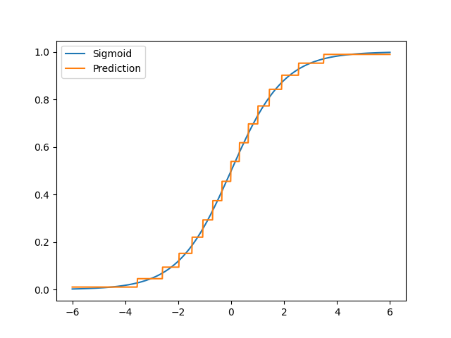

# learning_trees

Toy project where we try to implement learning trees in python.

## How to use

install package via 
```shell
# inside repository root
poetry install
```

Then you can just execute it via
```python
from learning_trees.regression import RegressionTree
import numpy as np

def sigmoid(x):
    return 1 / (1+np.exp(-x))

x = np.expand_dims(np.linspace(-6, 6, 100), 0)
y = sigmoid(x[0])

tree = RegressionTree().train(x, y)
y_hat = tree.predict(x)

```

# Todo:
- [x] Some Test classes
- [x] Implement Decision trees
- [ ] Implement Random forest
